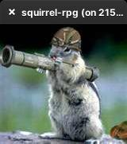
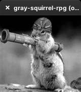
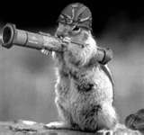

# Setting up

```bash
$ docker compose build
$ docker compose run app bash
$ irb
irb(main):001:0> 
```

## Simple Introduction

* The opencv read the image as BGR (blue-green-red) instead of RGB(red-green-blue);
* The matrix that represents the image is order by columns, lines from top to bottom;

Load the OpenCv in a ruby script or in the irb.

```ruby
require 'opencv'
include OpenCV
```

* The simple representation of a pixel image is made by the "scalar" object;
* The "scalar" object is a representation of a vector with 4 positions: B G R T;
* Each position represent the color intensity value, and the range is definied by the depth, usually is 8 bits;

```ruby
irb(main):001:0> CvColor::White
=> #<OpenCV::CvScalar:0x00000000015948f8>
irb(main):002:0> CvColor::White.to_a
=> [255.0, 255.0, 255.0, 0.0]
irb(main):003:0> CvColor::Blue 
=> #<OpenCV::CvScalar:0x0000000001593b38>
irb(main):004:0> CvColor::Blue.to_a
=> [255.0, 0.0, 0.0, 0.0]
irb(main):005:0> CvColor::Green.to_a
=> [0.0, 128.0, 0.0, 0.0]
irb(main):006:0> CvColor::Red.to_a
=> [0.0, 0.0, 255.0, 0.0]
irb(main):007:0> CvColor::Black.to_a
=> [0.0, 0.0, 0.0, 0.0]
```

## Loading an Image and showing it

```ruby
image = CvMat.load "./images/squirrel-rpg.jpg", CV_LOAD_IMAGE_COLOR

window = GUI::Window.new("squirrel-rpg")
window.show image
GUI.wait_key
```



The `CV_LOAD_IMAGE_COLOR` is the param to define that the image that will be loaded, is a color image.
If you wanna to load a gray scaled image, you can use the `CV_LOAD_IMAGE_GRAYSCALE` parameter.

More about it:

* `CvMat`: [https://www.rubydoc.info/gems/ruby-opencv/OpenCV/CvMat](https://www.rubydoc.info/gems/ruby-opencv/OpenCV/CvMat)
* `GUI`: [https://www.rubydoc.info/gems/ruby-opencv/OpenCV/GUI](https://www.rubydoc.info/gems/ruby-opencv/OpenCV/GUI)
* `GUI::Window`: [https://www.rubydoc.info/gems/ruby-opencv/OpenCV/GUI/Window](https://www.rubydoc.info/gems/ruby-opencv/OpenCV/GUI/Window)

## What is a "CvMat"?

The CvMat is the class object of a digital image representation to opencv.
You can read more about it in the official documentation below:

* [https://docs.opencv.org/2.4.9/modules/core/doc/basic_structures.html#mat](https://docs.opencv.org/2.4.9/modules/core/doc/basic_structures.html#mat)

## Transforming the color space of an Image

```ruby
image = CvMat.load "./images/squirrel-rpg.jpg", CV_LOAD_IMAGE_COLOR
gray_image = image.BGR2GRAY

window = GUI::Window.new("gray-squirrel-rpg")
window.show gray_image
GUI.wait_key
```



You can look at some other color space transformations at the bottom of this page(just search for `BGR2GRAY`):

* [https://www.rubydoc.info/gems/ruby-opencv/OpenCV](https://www.rubydoc.info/gems/ruby-opencv/OpenCV)

## Saving the loaded image

```ruby
image = CvMat.load "./images/squirrel-rpg.jpg", CV_LOAD_IMAGE_COLOR
gray_image = image.BGR2GRAY
gray_image.save_image('gray-squirrel.jpg')
```



## Generating an Image with a text follow by a rectangle

```ruby
banner = CvMat.new(50, 500, CV_8U, 3).fill!(CvColor::White)
banner.put_text!('My message', CvPoint.new(5, 40), CvFont.new(:simplex), CvColor::Blue)
banner.rectangle!(CvPoint.new(200,10), CvPoint.new(300,40), color: CvColor::Black, thickness: 1)

banner.save_image('images/banner.jpg')
```


The banner script is already here, you can simple run:

```bash
$ ruby banner.rb
```

It will generate the banner inside of the `images` folder.

More about it:

* `put_text!`: [https://www.rubydoc.info/gems/ruby-opencv/OpenCV/CvMat#put_text!-instance_method](https://www.rubydoc.info/gems/ruby-opencv/OpenCV/CvMat#put_text!-instance_method)
* `CvPoint`: [https://www.rubydoc.info/gems/ruby-opencv/OpenCV/CvPoint](https://www.rubydoc.info/gems/ruby-opencv/OpenCV/CvPoint)
* `CvFont`: [https://www.rubydoc.info/gems/ruby-opencv/OpenCV/CvFont](https://www.rubydoc.info/gems/ruby-opencv/OpenCV/CvFont)
* `rectangle!`: [https://www.rubydoc.info/gems/ruby-opencv/OpenCV/CvMat#rectangle!-instance_method](https://www.rubydoc.info/gems/ruby-opencv/OpenCV/CvMat#rectangle!-instance_method)

## Documentation

The only available documentation for the `ruby-opencv` gem is only this one:

* [https://www.rubydoc.info/gems/ruby-opencv/index](https://www.rubydoc.info/gems/ruby-opencv/index)

Is not a full documentation about the open cv, is more like a method documentation.
But you can read more about the opencv below:

* [https://docs.opencv.org/2.4.9/](https://docs.opencv.org/2.4.9/)

Also, the gem have implemented some examples, including a detecting objects and faces:

* [https://github.com/ruby-opencv/ruby-opencv/tree/master/examples](https://github.com/ruby-opencv/ruby-opencv/tree/master/examples)
* [find_obj.rb](https://github.com/ruby-opencv/ruby-opencv/blob/master/examples/find_obj.rb)
* [face_detect.rb](https://github.com/ruby-opencv/ruby-opencv/blob/master/examples/face_detect.rb)
